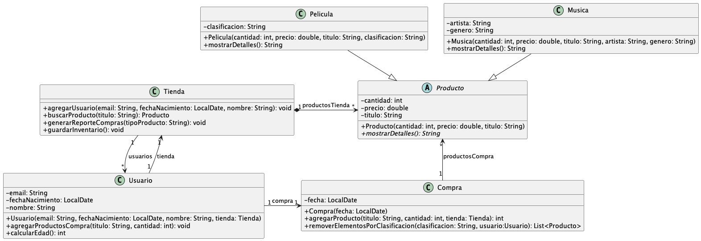

# Solución del parcial 2 2024-3

## I. (20 puntos) Conceptos

1. ¿Se puede sobrescribir un método `private`?
    - a) Verdadero
    - b) Falso
   

      
Ver respuesta

      b) Falso
   
 

2. ¿Una clase abstracta obligatoriamente debe tener 1 método abstracto?
    - a) Verdadero
    - b) Falso
   

      
Ver respuesta

      b) Falso
   
 

3. Para comparar que dos cadenas de texto son iguales, en cuanto a contenido, el método que se utiliza es:
    - a) `=`
    - b) `equals()`
    - c) `compare()`
    - d) `match()`
   

      
Ver respuesta

      b) `equals()`
   
 

4. Las cláusulas `throw` y `throws` se utilizan, en el contexto de excepciones:
    - a) En los métodos donde puede ocurrir un rompimiento de reglas de negocio, una para lanzar explícitamente y la otra para habilitar el método para que lance una o más excepciones
    - b) Dentro del `try/catch` de los métodos que invocan a otros métodos
    - c) Dentro del `finally`, en donde sus instrucciones ocurren suceda o no suceda excepciones
    - d) En los métodos del `main` ya que allí es donde se toma o no el control
   

      
Ver respuesta

      a) En los métodos donde puede ocurrir un rompimiento de reglas de negocio, una para lanzar explícitamente y la otra para habilitar el método para que lance una o más excepciones
   
 

5. El encapsulamiento consiste en:
    - a) Declarar los métodos `private` y los atributos `public`
    - b) Declarar los métodos `private` y los atributos `private`
    - c) Declarar los métodos `public` y los atributos `private`
    - d) Declarar los métodos `public` y los atributos `public`
   

      
Ver respuesta

      c) Declarar los métodos `public` y los atributos `private`
   
 

6. Si una clase `Animal` tiene un método `hacerSonido()`, y la clase `Perro` hereda de `Animal`, ¿qué sucede si `Perro` no implementa su propia versión del método?
    - a) Se generará un error de compilación.
    - b) Se usará el método `hacerSonido()` de `Animal`.
    - c) El método será abstracto en `Perro`.
    - d) El programa fallará en tiempo de ejecución.
   

      
Ver respuesta

      b) Se usará el método `hacerSonido()` de `Animal`.
   
 

7. Suponga que existe una clase `Jeep`, que hereda de la clase `Automovil`, seleccione la instrucción que es incorrecta:
    - a) `Automovil A = new Jeep();`
    - b) `Jeep A = new Automovil();`
    - c) `Automovil A = new Automovil();`
    - d) `Jeep A = new Jeep();`
   

      
Ver respuesta

      b) `Jeep A = new Automovil();`
   
 

8. ¿Cuál es el comportamiento de un método estático en Java?
    - a) Puede acceder a atributos y métodos no estáticos directamente.
    - b) Sólo puede acceder a atributos y métodos de instancia.
    - c) Sólo puede acceder a atributos y métodos de clase.
    - d) Puede acceder a otros métodos, tanto de clase como de instancia.
   

      
Ver respuesta

      c) Sólo puede acceder a atributos y métodos de clase.
   
 

9. ¿Qué ocurre cuando se define un método con el modificador `final` en una clase `A`?
    - a) El método debe ser implementado en las clases que heredan de `A`.
    - b) El método solo puede ser usado directamente en cualquier parte, incluso, sobrescrito por las subclases de `A`.
    - c) El método no puede ser sobrescrito en las clases que heredan de `A`.
    - d) El método puede ser sobrescrito y usado directamente en las clases que heredan de `A`.
   

      
Ver respuesta

      c) El método no puede ser sobrescrito en las clases que heredan de `A`.
   
 

10. Para obtener el tamaño de un `ArrayList`, el método que se debe llamar es:
    - a) `length()`
    - b) `size()`
    - c) `capacity()`
    - d) `count()`
    

       
Ver respuesta

       b) `size()`
    
 
## II. (80 PUNTOS) SISTEMA PARA GESTIONAR MÚSICA Y PELÍCULAS DE UNA TIENDA

### 1) (15 puntos) Definición de clases y atributos:
Defina todas las clases representadas en el siguiente diagrama UML. Solo debe definir el encabezado de cada clase y TODOS sus atributos. Además, para las clases `Producto`, `Película` y `Música`, debe escribir el método constructor. Finalmente, escriba en la clase `Producto` los métodos abstractos que tenga.

**Notas:**
1) La clase `Producto` es abstracta y el método `mostrarDetalles` de esta clase también es abstracto.
2) Los métodos `calcularEdad` y `agregarProductosCompra` (ambos de la clase `Usuario`) ya están implementados.
3) Las clasificaciones de las películas son: A (para todo el público), B (para mayores de 13), B15 (para mayores de 15) y R (para mayores de 18).

### 2) (65 puntos) Definición de métodos:

| Clase      | Puntos | Método por implementar                                                                                                                                                                                                                                                                                                                                                                                                                                                                                                                                                                                                                                                                                             |
|------------|--------|--------------------------------------------------------------------------------------------------------------------------------------------------------------------------------------------------------------------------------------------------------------------------------------------------------------------------------------------------------------------------------------------------------------------------------------------------------------------------------------------------------------------------------------------------------------------------------------------------------------------------------------------------------------------------------------------------------------------|
| **Tienda** | 5      | [`guardarInventario`: método que guarda la tienda en un archivo serializado llamado `inventario.bin`](./src/main/java/com/example/model/Tienda.java#L65).                                                                                                                                                                                                                                                                                                                                                                                                                                                                                                                                                          |
| **Película**   **Música** | 5      | `mostrarDetalles`: método que muestra la información relevante de cada tipo de producto. ([Método en clase `Pelicula`](./src/main/java/com/example/model/producto/Pelicula.java#L34), [Método en clase Musica](./src/main/java/com/example/model/producto/Musica.java#L30))                                                                                                                                                                                                                                                                                                                                                                                                                                        |
| **Tienda** | 5      | [`buscarProducto`: método que busca un producto por su título](./src/main/java/com/example/model/Tienda.java#L77). Si el producto no se encuentra, debe retornar `null`.                                                                                                                                                                                                                                                                                                                                                                                                                                                                                                                                           |
| **Compra** | 15     | [`agregarProducto`: método que recibe el título del producto, la tienda y la cantidad de unidades a comprar](./src/main/java/com/example/model/Compra.java#L51). Si el producto no existe en la Tienda, debe arrojar una excepción, mencionando la no existencia del producto. Si no hay suficiente inventario del producto para satisfacer la compra, es decir, si se desea comprar una cantidad mayor a la existente en la tienda, lanza una excepción de inventario insuficiente. Retorna la cantidad del producto que queda, una vez se ha adicionado ese producto a la compra.                                                                                                                                |
| **Tienda** | 5      | [`agregarUsuario`: método que, dado el email, la fecha de nacimiento y el nombre del usuario, lo agrega a la lista de usuarios de la Tienda](./src/main/java/com/example/model/Tienda.java#L90). Si el usuario ya existe (hay un usuario con el mismo email), lanza una excepción.                                                                                                                                                                                                                                                                                                                                                                                                                                 |
| **Compra** | 15     | [`removerElementosPorClasificacion`: método que elimina todos los productos de tipo `Película` que tengan la clasificación dada como parámetro](./src/main/java/com/example/model/Compra.java#L77). Si la compra incluye productos de tipo `Película` y no cumple con la clasificación requerida (es decir, el Usuario, pasado como parámetro, tiene una edad inferior a la clasificación de esa película), ese producto se debe eliminar de la lista de productos de la compra. El método debe retornar los elementos actualizados de la compra. Cabe mencionar que si la `Película` tiene como clasificación `A`, nunca será eliminada. *(Nota: puede utilizar el método `calcularEdad` de la clase `Usuario`)*. |
| **Tienda** | 15     | [`generarReporteCompras`: recibe como parámetro el tipo de producto (por ejemplo, Música o Película) y genera un reporte en un archivo de texto llamado `productos.txt`](./src/main/java/com/example/model/Tienda.java#L120). El reporte debe seguir el siguiente formato:  `<Tipo Producto> - <Toda la información específica del producto>`  **Por ejemplo:**  `<Música>-<"Luna",3,$10000,"Feid","Reggaeton">` `<Película>-<"Eterno resplandor de una mente sin recuerdos",5,$20000,"B15">`.                                                                                                                                                                                                        |

**Notas adicionales:**
Para cualquiera de estos métodos puede usar métodos desarrollados en otros puntos del examen. En caso de usar métodos adicionales o auxiliares que no estén incluidos en este enunciado, debe implementarlos completamente.
